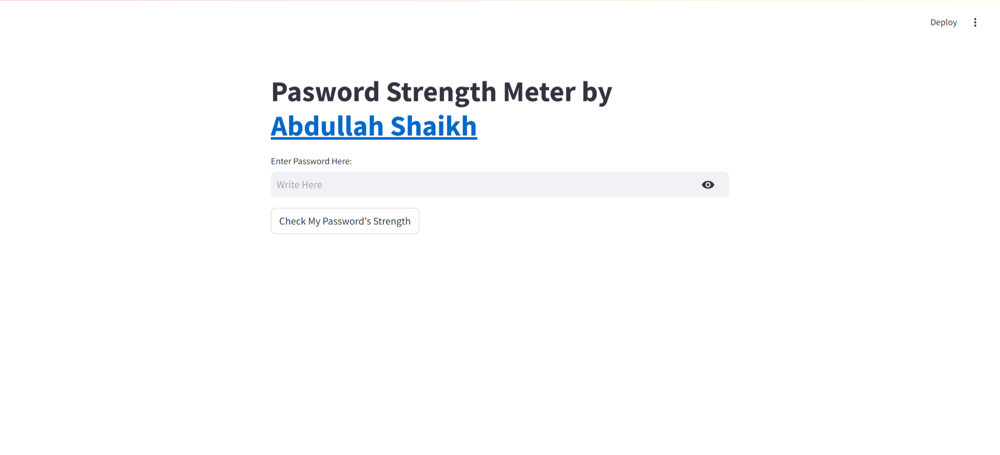

# Password Strength Meter

This Streamlit application allows users to check the strength of their passwords. It evaluates passwords based on length, the presence of uppercase and lowercase letters, digits, and special characters.

## Features

* **Real-time Password Strength Check:** Users can input their password and receive immediate feedback on its strength.
* **Weak Password Detection:** The application checks against a list of common weak passwords.
* **Strength Evaluation:** Passwords are scored based on factors like length, character variety, and complexity.
* **User-Friendly Interface:** The application provides clear instructions and feedback to guide users in creating strong passwords.
* **Clear messages:** The user is provided with clear messages on what is wrong with their password.

## How to Use

1. Open [App](https://password-strength-meter-6601.streamlit.app/)
2.  Open your web browser to the displayed URL.
3.  Enter your password in the input field and click "Check My Password's Strength."
4.  Review the feedback provided by the application.

## Code Explanation

* The application uses Streamlit to create the user interface.
* A list of common weak passwords is defined.
* The `check_pasword_strength` function evaluates the password based on various criteria using regular expressions.
* The application provides feedback based on the password's score.

## Author

* [Abdullah Shaikh](https://www.linkedin.com/in/abdullah-shaikh-29699b302/)

## Contributions

Contributions are welcome! If you find any issues or have suggestions for improvements, please feel free to submit a pull request.

## Example

Here is a screenshot of the application.

(If you have a screenshot of your app, replace `icon.png` with the actual image file.)

## Deployment Link:
https://password-strength-meter-6601.streamlit.app/
## Security Note

This application is intended for educational purposes. Always prioritize password security and use strong, unique passwords for your online accounts.